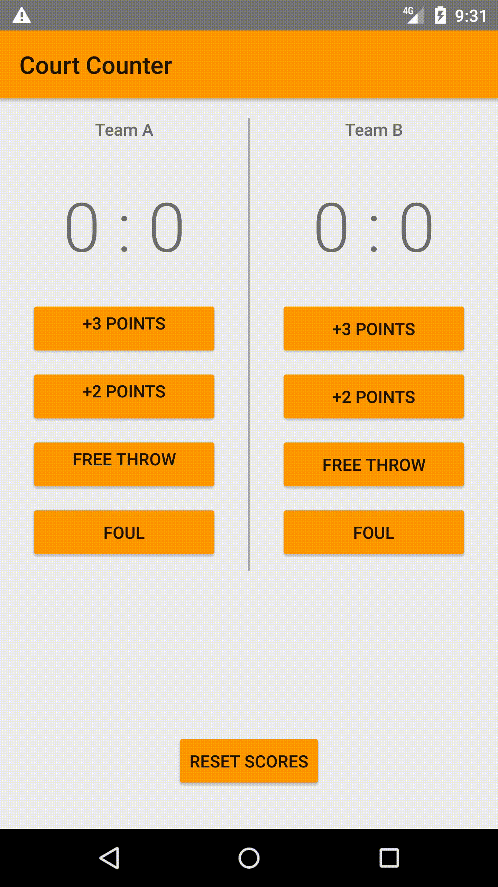

### Court Counter Score Tracking App
This is an kotlin app that will keep track of two team's score

## Points options are as followed
```
*+3 points
*+2 points
*+1 point
*-2 point (for a foul)
```

## Reset option provided to start from a clean slate


## Demo

